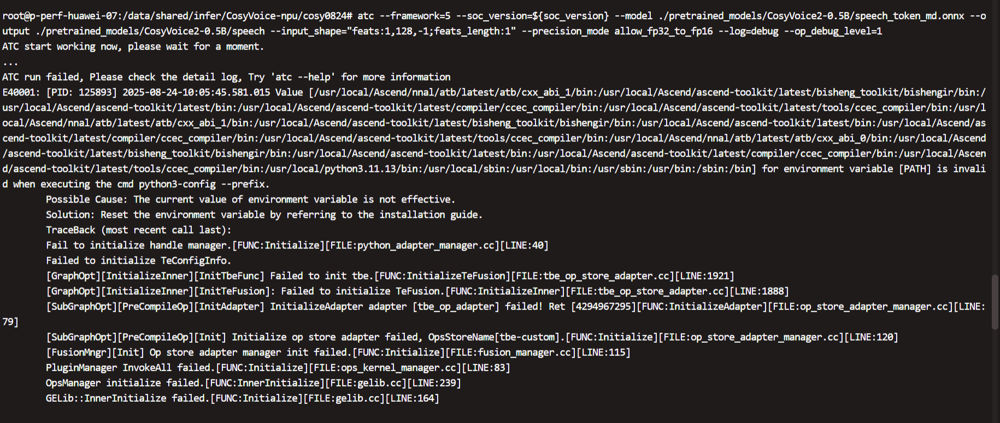
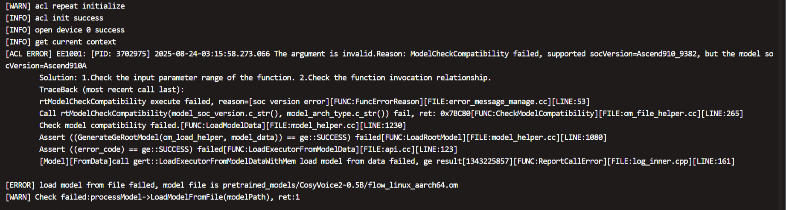
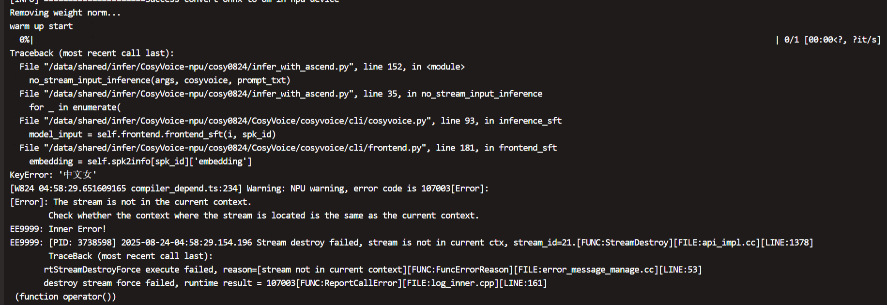

## 打包

```bash
tar -zcvf ../backup.tar.gz --exclude=.venv --exclude=pretrained_models --exclude=output .
```

## 容器

```bash
docker run -itd --name vllm-090 \
    --privileged \
    --net=host \
    --shm-size=1000g \
    -w /workspace \
    -v /usr/local/Ascend/driver:/usr/local/Ascend/driver:ro \
    -v /usr/local/Ascend/firmware:/usr/local/Ascend/firmware:ro \
    -v /usr/local/sbin/npu-smi:/usr/local/sbin/npu-smi \
    -v /usr/local/sbin:/usr/local/sbin \
    -v /etc/hccn.conf:/etc/hccn.conf \
    -v /data:/data \
    swr.cn-south-1.myhuaweicloud.com/ascendhub/cann:8.2.rc1-a3-ubuntu22.04-py3.11 bash

docker run -itd --name vllm-090v2 \
    --privileged \
    --net=host \
    --shm-size=1000g \
    -w /workspace \
    -v /usr/local/Ascend/driver:/usr/local/Ascend/driver:ro \
    -v /usr/local/Ascend/firmware:/usr/local/Ascend/firmware:ro \
    -v /usr/local/sbin/npu-smi:/usr/local/sbin/npu-smi \
    -v /usr/local/sbin:/usr/local/sbin \
    -v /etc/hccn.conf:/etc/hccn.conf \
    -v /data:/data \
    mindie:dev-2.1.RC1.B082-800I-A3-py311-ubuntu22.04-aarch64 bash

```

## 安装虚拟环境


```bash
apt install -y sox libsox-dev

export UV_PYTHON_INSTALL_MIRROR="https://gh-proxy.com/https://github.com/astral-sh/python-build-standalone/releases/download"
# export UV_PYTHON_INSTALL_MIRROR="https://ghfast.top/https://github.com/astral-sh/python-build-standalone/releases/download"

pip install uv
uv sync
source .venv/bin/activate
/msit/msit# uv pip install -v .
```


```bash
export TASK_QUEUE_ENABLE="2"
export CPU_AFFINITY_CONF="2"
export HCCL_OP_EXPANSION_MODE="AIV"
export HCCL_DETERMINISTIC="false"
export PYTORCH_NPU_ALLOC_CONF="expandable_segments:True"
export INF_NAN_MODE_FORCE_DISABLE="1"
export OPENBLAS_NUM_THREADS=10

export VLLM_USE_V1=0
export VLLM_VERSION=0.9.0
```




```bash
# 使用mindie镜像，不能使用cann镜像
soc_version="Ascend910_9382"
atc --framework=5 --soc_version=${soc_version} --model ./pretrained_models/CosyVoice2-0.5B/speech_token_md.onnx --output ./pretrained_models/CosyVoice2-0.5B/speech --input_shape="feats:1,128,-1;feats_length:1" --precision_mode allow_fp32_to_fp16
atc --framework=5 --soc_version=${soc_version} --model ./pretrained_models/CosyVoice2-0.5B/flow.decoder.estimator.fp32.onnx --output ./pretrained_models/CosyVoice2-0.5B/flow --input_shape="x:2,80,-1;mask:2,1,-1;mu:2,80,-1;t:2;spks:2,80;cond:2,80,-1"
atc --framework=5 --soc_version=${soc_version} --model ./pretrained_models/CosyVoice2-0.5B/flow.decoder.estimator.fp32.onnx --output ./pretrained_models/CosyVoice2-0.5B/flow_static --input_shape="x:2,80,-1;mask:2,1,-1;mu:2,80,-1;t:2;spks:2,80;cond:2,80,-1" --dynamic_dims="100,100,100,100;200,200,200,200;300,300,300,300;400,400,400,400;500,500,500,500;600,600,600,600;700,700,700,700" --input_format=ND
```
## 

Install torch_npu

```bash
uv add torch-npu==2.5.1.post1.dev20250528 --index https://mirrors.huaweicloud.com/ascend/repos/pypi
```
